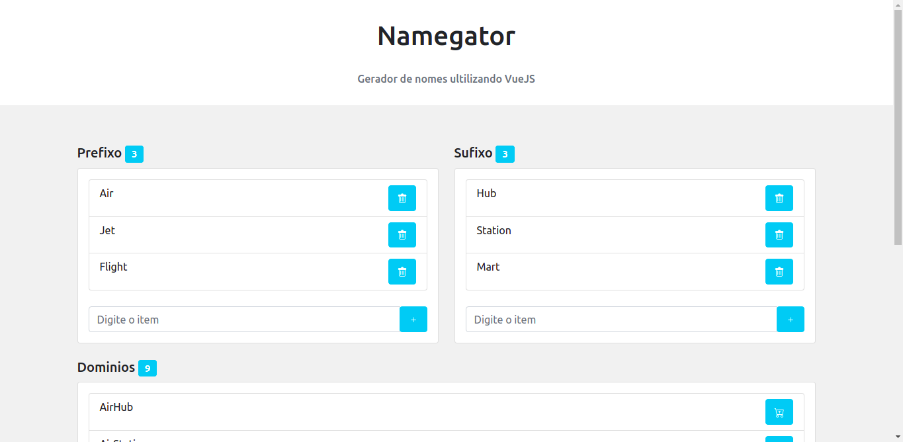

> __Namegator__ é um sistema gerador de nomes com base em __prefixes__ e __sufixes__. Pode ser usando para gerar nomes de dominios com por exemplo.

## Project setup
```
npm install
```

### Compiles and hot-reloads for development
```
npm run serve
```

### Compiles and minifies for production
```
npm run build
```

### Lints and fixes files
```
npm run lint
```

### Informações adicionais
<span> Esse sistema foi implementado do curso de VueJS do __Rodrigo Branas__
 no youtube</span>
<br>

<https://www.youtube.com/channel/UCkqOofjb7nl6V8vXrIbGtiQ>
